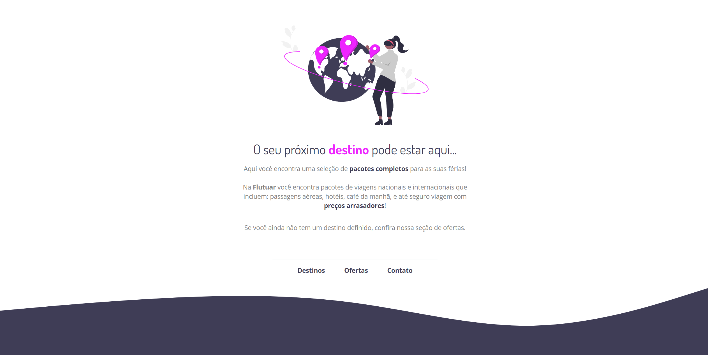

# Desafio intermediário
## Recriando layout
Desafio consiste em recriar uma aplicação, a partir de um layout pronto no [Figma](https://www.figma.com/file/waisYRoNzeBgIxOyrz0b2R/Projeto01-Extra/duplicate), para fortalecer alguns conceitos aprendidos em aula, entre eles:

- Estruturando um projeto HTML;
- Uso de tags HTML mais comuns;
- Conceitos iniciais de CSS;
- Posicionamento e alinhamento de elementos na tela;
- Aplicando fontes customizadas;
- Espaçamentos.

Figura 1: Prototipo no Figma da aplicação a ser desenvolvida.

## Conclusão
Após o desenvolvimento da aplicação seguindo o prototipo apresentado no [Figma](https://www.figma.com/file/waisYRoNzeBgIxOyrz0b2R/Projeto01-Extra/duplicate) obteve-se o resultado a seguir:

Figura 2: Aplicação desenvolvida seguindo o prototipo do Figma.

### Ideias e próximos passos
Neste repositório há uma branch com o nome "ideas" e nessa branch haverá algumas implementações que acredito que seriam interessantes para a aplicação, como a implementação de _hover_ nos links da página para mudarem para a cor rosa e a implementação da responsividade, em telas menores o layout da aplicação não se mantem e isso não é legal.
